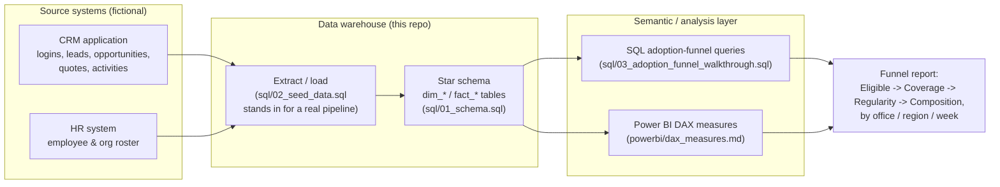
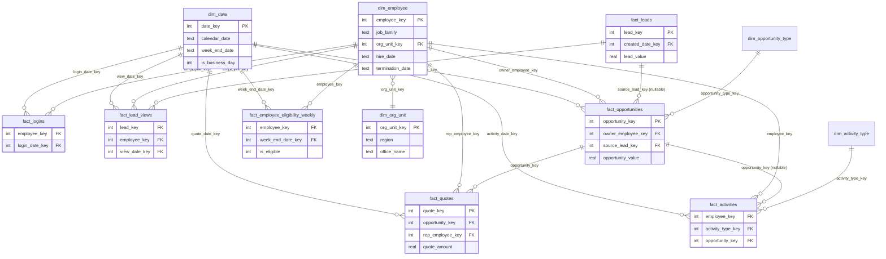

# CRM Adoption Analytics

A small, fully self-contained data warehouse + SQL case study: modeling
**"is the sales team actually using the CRM?"** as a funnel, from raw event
data down to office-level adoption rates.

This is a portfolio project built around a fictional company (**Vantage
Sales Group**, a made-up B2B sales organization) and 100% synthetic data. No
real people, employers, or CRM systems are represented. It's designed to be
cloned and run in a couple of minutes.

## The problem

"Are people using the CRM" is a deceptively hard question to answer well.
A naive version — count total logins — rewards a handful of power users and
hides the rest of the team. The better version treats adoption as a
**funnel**, where each stage is a stricter filter on the last:

1. **Eligible** — who's *supposed* to be using it (current employees in a
   CRM-facing role, resolved as of the period being measured — not today's
   headcount, so historical weeks stay accurate after someone leaves).
2. **Coverage** — of those eligible, who used it *at all* this period.
3. **Regularity** — of those, who used it in *most weeks*, not just once.
4. **Composition** — broken down by *what kind* of usage (logins vs. lead
   review vs. opportunity creation vs. quoting vs. activity logging), so you
   can see which behaviors are sticking and which aren't.

Coverage and regularity look identical for someone who logged in once and
someone who logs in every day — until you measure both. This project builds
that distinction from the ground up in SQL, and mirrors it in a set of
Power BI DAX measures.

## Architecture



In a real deployment, `Sources` would be live systems feeding a nightly ETL
job instead of a static seed script — everything downstream of the star
schema is written to work unmodified against that kind of pipeline.

## Data model

A star schema: one fact table per trackable CRM behavior, plus a weekly
eligibility snapshot that anchors every rate calculation to a point-in-time
denominator instead of current headcount.



`fact_leads` is deliberately kept free of any employee reference — a lead
exists before anyone has engaged with it. `fact_lead_views` is the bridge
that records *who* reviewed *which* lead *when*, which is what "lead
engagement" adoption is actually measured from.

## Repo structure

```
crm-adoption-analytics/
├── README.md                              <- you are here
├── sql/
│   ├── 01_schema.sql                      <- DDL for the star schema
│   ├── 02_seed_data.sql                   <- synthetic sample data (generated, see below)
│   ├── 03_adoption_funnel_walkthrough.sql <- the executable walkthrough, step by step
│   └── 04_bonus_queries.sql               <- extra queries: pipeline mix, rep leaderboard, tenure cohorts
├── data/
│   └── generate_sample_data.py            <- reproducibly regenerates 02_seed_data.sql
└── powerbi/
    └── dax_measures.md                    <- the same funnel, as Power BI DAX measures
```

## Running it

The SQL is written against SQLite (no server to stand up) and is portable to
Postgres/DuckDB/SQL Server with minor syntax changes. Two ways to run it:

**Using the `sqlite3` CLI:**

```bash
sqlite3 adoption.db < sql/01_schema.sql
sqlite3 adoption.db < sql/02_seed_data.sql
sqlite3 adoption.db < sql/03_adoption_funnel_walkthrough.sql
```

**Using Python (works anywhere Python 3 is installed, `sqlite3` is in the standard library):**

```python
import sqlite3

conn = sqlite3.connect("adoption.db")
for path in ["sql/01_schema.sql", "sql/02_seed_data.sql", "sql/03_adoption_funnel_walkthrough.sql"]:
    conn.executescript(open(path).read())
conn.commit()
```

To regenerate the sample data yourself (same output, since the random seed
is fixed):

```bash
python3 data/generate_sample_data.py > sql/02_seed_data.sql
```

## What the walkthrough shows

Running `03_adoption_funnel_walkthrough.sql` against the included sample
data (21 eligible employees across 4 offices, 10 weeks of activity) produces
a funnel that tells a realistic adoption story:

| Behavior | Coverage (used it at all) | Regularity (used it 8+ of 10 weeks) |
|---|---|---|
| Logins | 100% | 85.7% |
| Activity logging | 100% | 52.4% |
| Lead review | 100% | 42.9% |
| Quote creation | 85.7% | *below threshold for everyone* |
| Opportunity creation | 76.2% | *below threshold for everyone* |

Read together, this is the shape most real CRM-adoption efforts eventually
find: everyone touches the tool at least once, but depth of usage drops off
fast as the behavior gets more specific — which is exactly the kind of gap
a funnel view is meant to surface, and a single "logins this month" number
would hide completely.

## Design notes

- **Point-in-time eligibility.** `fact_employee_eligibility_weekly` is a
  snapshot, not a live join to `dim_employee`'s current state, specifically
  so that a person who left mid-quarter doesn't get silently erased from
  historical weeks they were actually active in.
- **One normalized event stream.** Five different fact tables all answer the
  same shape of question ("did this person do a CRM-tracked thing on this
  date?"). Rather than writing near-duplicate regularity logic five times,
  `v_employee_events` (created in step 3 of the walkthrough) unions them
  into one tagged stream so coverage and regularity are each written once
  and reused across every behavior.
- **Data-driven eligibility rules.** Which job families count toward the
  eligible population lives in `ref_eligible_job_families`, a real table,
  not a hardcoded list inside a `WHERE` clause — so the rule is auditable
  and changeable without touching query logic.
